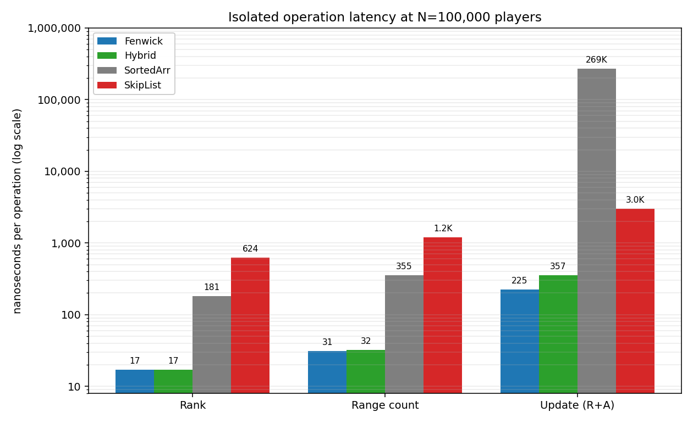
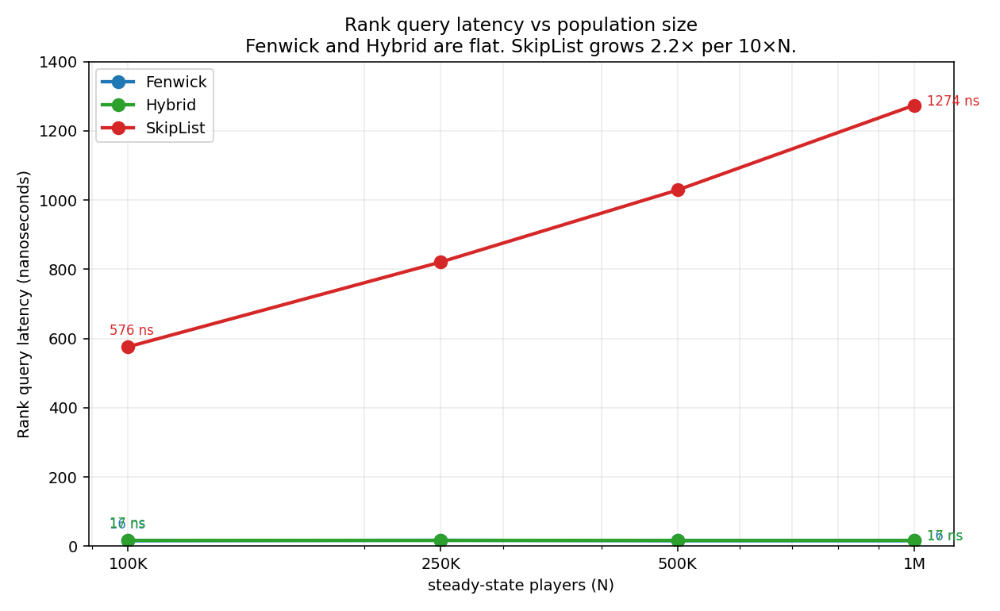
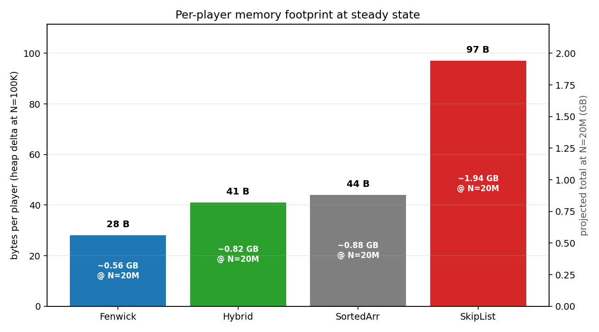

# Skip lists are the wrong default for matchmaking queues: a Fenwick tree case study

If you happen to develop a multiplayer game with a large number of users at scale, you will ask yourself a question: how would people be arranged into matches? First of all, you need a separate matchmaker service to handle ticket intake and create player assignments, and it should use common criteria to match players accordingly. Some of them will require a hard split into non-intersecting groups, such as region, game mode, and other factors. Still, once this sharding is done, for most games you will need to consider players' experience to match people with similar skills: that could be their level, rating, score, etc. Let’s call this number **MMR (matchmaking rank)**.

Most articles about matchmaking focus on the rating system itself (like Elo, Glicko-2, or TrueSkill 2), but rarely on the layer underneath: once your rating system has assigned an MMR (matchmaking rank) to every player currently in the queue, what queries will be performed to make a match, and what data structure will serve all these queries?

## Background

Let's dive deeper into how the rank-based matchmaker works.  As we discussed, requests will likely be sharded by region, game mode, etc., but once this step is done, the matchmaking backend handles those requests and decides how to match players.

To do this, the matchmaker needs to know whether there are enough compatible players within the acceptable MMR range for each group. As the goal is to match players with as small a rating difference as possible, the acceptable range widens until a match is found. Usually it starts at ±50 MMR and often reaches ±500 MMR, making it ask a lot of **range-count query** calls. Let's assume that in a typical mature live multiplayer game, the system should handle around **50,000 range-count queries/sec** per shard.

Another important query, usually answered using the same data structure, is a **global rank query**. It returns the user's exact global rank for the specified MMR and is primarily used to display that rank on the leaderboard. This one is not a part of the matchmaking itself, but I measure this query's performance to understand each candidate's impact. Let's assume that the system can receive about **5,000 global rank queries/sec** per shard.

Last, but not least, the queries that I should mention: adding and removing players from the matchmaking queue. The data structure should be able to dynamically update the queue with low latency, as we expect a high volume of requests at scale, not to mention retries due to network errors, delays, client issues, etc. 

The straightforward choice for answering these queries is a sorted set that uses a skip list, like the one Redis ships with under `ZRANGEBYSCORE`. For example, this was used for a while as a standard solution by OpenMatch and may still be considered a good candidate by some engineers. However, it turned out to be worse than the obvious choice by an order of magnitude. Let’s consider alternatives, benchmark the candidates, and walk through what we find.

## Fenwick tree: how to apply here

This data structure can process range-sum queries and updates in O(log N) time, where N is the tree size, by leveraging the properties of binary operations to construct a nested tree structure. Originally proposed by Peter Fenwick in 1994 for cumulative frequency tables in compression. For those who want to dive deeper, I would recommend reading [this article](https://cp-algorithms.com/data_structures/fenwick.html) at [cp-algorithms.com].

In our case, I would bucketize MMR to integer slots (I used a bucket size of 1, so 5000 buckets for MMR in [0, 5000]), and use a Fenwick tree to get O(log B) time per operation, where B is the bucket count (not the player count; that’s important). Memory complexity is O(B) and doesn’t depend on the number too. The main problem with this data structure is that it stores counts rather than players, so it can’t tell you which players are in a given bucket. That’s why it needs an enhancement.

### Hybrid approach: a step forward

The hybrid candidate fills the gap by adding two pieces of state alongside the Fenwick tree (I use Go for benchmarking; it will be explained further in **Methodology**):


```go
type Hybrid struct {
    tree    []int64                  // Fenwick tree, same as standalone
    buckets [][]uint64               // buckets[mmr] = player IDs in that bucket
    info    map[uint64]playerInfo    // playerID -> (mmr, index in bucket)
    size    int
}

type playerInfo struct {
    mmr int32
    pos int32 // index into buckets[mmr]
}
```

To serve **add queries**, this structure needs to append to the bucket and stamp the index into the info, in addition to standard Fenwick operations. To remove a player, the structure should use a swap-and-pop on the bucket (O(1)), update the info for the swapped player, and decrement the tree.  Global rank and range count require querying only the tree; no need to use buckets or an index map. To get the list of players within the given range, the algorithm has to iterate over the buckets in that range and return the player IDs, with complexity O(K + width-of-range), where K is the result size.

## Candidates to test

I considered six structures, and ended up testing four of them:

**Sorted array with binary search.** This algorithm is a baseline and included to show what we are optimizing relative to, not a solution for production use. Has O(log N) complexity for queries and O(N) for updates because every insert and delete on a sorted slice involves shifting the tail of the array.

**Skip list (Redis ZSET).** As I said, this data structure is used as a default sorted set and provides O(log N) complexity for updates and queries. The important advantage is that this structure is part of the standard Redis. I implemented it locally to reduce serialization and network costs, giving it the fairest conditions compared to other candidates. In this article, I will proceed with a standard memory allocation using  New, but I also implemented `sync.Pool` version to test how separating the algorithm cost from the allocator overhead affects latency. As a result, it didn’t change query latency but reduced update time by 25%. This is not included as a separate candidate, but it's something you should note in case you have to use a skip list.

**Hybrid: Fenwick + per-bucket player lists.** Addresses the main disadvantage of Fenwick by maintaining a slice of queued player IDs and a map from player ID to (bucket, index in bucket). These structures enable exact rank and removal in O(1) with an additional cost of using more memory and slightly slowing writes.

**Fenwick tree.** As described above, it doesn’t fully serve the purpose of the experiment, but it is included here to isolate the range-count query cost from the enumeration overhead. Also, the structure may be useful if you maintain a separate index for iteration over the range. 

### No-go

**t-digest.** This structure is an approximate quantile sketch. I initially included it as a candidate for approximate range counts, but after looking at the exact methods’ latency floor (sub-100 ns), I realized there is no scenario where removing exactness to increase speed makes sense within a single shard.

**B+ trees.** In practice, a Go B+ tree has all the downsides of a skip list: it is pointer-heavy and incurs cache misses at every level, so I will proceed with using just a skip list instead.

## Methodology

### Measurements

Every candidate is run on the same fixed test set to ensure results consistency. During the test, I measure time (latency) and memory usage for each candidate and operation type.

I calculate two different values for latency: the average of `testing.B` runs for pure algorithmic cost and per-operation latency under the production distribution to test tail behavior (1.78% updates, 8.93% rank queries, 89.29% range queries). To measure memory usage, I use `runtime.ReadMemStats` to get a heap-delta at a steady state and perform forced garbage collections.

To avoid concurrency costs and measure only the algorithmic latency of each candidate, I will take a tick-level snapshot to ensure read consistency.

### Testing

I use three different MMR distributions to run tests:

* *Uniform* - a standard uniform distribution between 0 and 5000
* *Skewed* - a representation of published LoL/Dota rank data using Gaussian distributions: 15% at N(1000, 80), 50% at N(1500, 120), 25% at N(2000, 100), and 10% at N(2500, 150)
* *Hot range* - 80% in N(1500, 60), 20% in U[200, 4000]

For correctness check, every candidate’s answer is compared with a result generated by a naive brute-force implementation (which performs a linear scan of all MMRs). The correctness test set includes 150,000 random operations and edge cases, including empty sets, single elements, all-same/min/max MMR, re-add after remove, etc.

To run tests, I use 1 vCPU Intel Xeon at 2.8 GHz, which has 4 GB RAM. The number of queries is scaled from 100,000 to 1,000,000. The code is written in Go 1.22.

## First measurements

Let’s run three operations for each candidate in isolation at N=100,000 players across all three distributions. Here are the medians across distributions in nanoseconds per operation (from `testing.B`):


| Operation       | Fenwick | Hybrid | SortedArr | SkipList |
|-----------------|--------:|-------:|----------:|---------:|
| Rank            | 17      | 17     | 181       | 624      |
| Range count     | 31      | 32     | 355       | 1,190    |
| Update (R+A)    | 225     | 357    | 269,000   | 2,993    |



The first thing you might notice is that the update cost for the sorted array is extremely high. However, this is easy to explain: a memmove on a 100K-element slice has O(N) time complexity. This is why I don’t consider it an actual candidate and use it as a floor I measure against.

The interesting finding is the skip list: I expected it to be in the same ballpark as Fenwick on queries (both are nominally O(log N)), but it is 35× slower on Rank and 38× slower on Range count. What happened to an algorithm that was meant to be efficient?

To answer this, let's dive deeper into how each solution allocates and accesses memory. Fenwick tree relies on flat arrays that are allocated in the same place in memory, so iterating over the elements of the array is faster because the array is L2-resident. On the other hand, the skip list uses pointers that are created and allocated in the memory separately, and this causes random jumps to unpredictable addresses throughout the heap, resulting in higher latency for every iteration that accumulates as the algorithm runs.

## Scaling from 100K to 1M

Now, let’s check what happens when N changes. Here are the results of running the same isolated benchmarks at four scales with a uniform distribution:


| Candidate       | Rank ns @100K | Rank ns @1M | Range ns @1M | Update ns @1M | Rank growth ×  |
|-----------------|--------------:|------------:|-------------:|--------------:|----------------:|
| Fenwick         | 16            | 16          | 31           | 352           | **1.00×**       |
| Hybrid          | 17            | 17          | 32           | 552           | **1.00×**       |
| SkipList        | 576           | 1,274       | 2,420        | 5,547         | **2.21×**       |



Might be surprising that Fenwick shows the same results for rank queries for both 100K and 1M: we increased the number of players by 10x, but still have identical query times. The reason is simple: Fenwick’s depth is `log₂(B)`, where B is constant regardless of how many players occupy the buckets, so the access pattern doesn’t change when N grows, as well as the tree array doesn’t change its size.

The skip list, by contrast, increases 2.2× on the same time. Theoretical algorithmic scaling for skip list with p=0.25 is log₄(10) ≈ 1.66, so I expected roughly 1.2× growth from 100K to 1M. Instead, I observed 2.21×, so the extra factor (about 1.85×) is most likely due to increased memory consumption.

## Compare median and p99 

To truly understand how the system works, we should measure two more things: checking a p50 would give us the median latency, while a p99 would indicate the latency we can promise to 99% of users. Here are the results for the production op mix (1.78% updates, 8.93% rank, 89.29% range count) at N=100,000 for 500,000 operations, across the three candidates (sorted array is excluded; its p99 is ~500ms, which is too slow for this comparison):

| Operation | Fenwick (p50 / p99) | Hybrid (p50 / p99) | SkipList (p50 / p99) |
|-----------|--------------------:|-------------------:|---------------------:|
| Rank      | 62 / 95             | 60 / 90            | 600 / 1,500          |
| Range     | 67 / 100            | 66 / 98            | 1,050 / 2,500        |
| Update    | 380 / 800           | 560 / 1,150        | 2,500 / 7,500        |

As you can see, Fenwick rank is 95/62 ≈ 1.5×, while skip list rank is 1,500/600 ≈ 2.5× (hybrid has numbers similar to Fenwick). There are two reasons why Fenwick’s distribution is tighter than the skip list’s:
* Fenwick’s memory is allocated as a single array of size < 5000, while the skip list uses pointers that are located in different places of memory, so dereferencing takes more time.
* Skip list depth is logarithmic probabilistically but can vary in different cases, while Fenwick’s depth is strictly limited by popcount (`log₂(B)` at most).

## Memory Usage

Let’s take a look at memory usage. Here is a per-player heap footprint at N=100,000, measured via `runtime.MemStats`:

| Candidate       | Bytes per player |
|-----------------|-----------------:|
| Fenwick         | 28               |
| Hybrid          | 41               |
| SortedArr       | 44               |
| SkipList        | 97               |




When you look at these numbers, it may sound like memory usage is not a big deal here, but if you project this linearly to 20,000,000 players (the upper end of my scenarios), it gives you roughly 560 MB for Fenwick versus 1.94 GB for skip list. Even with a hybrid approach, memory usage is 860 MB, which is half that of a skip list. You may argue that memory is not critical here, but using this structure can free up workload capacity for other important tasks (like indexing) or reduce cloud costs, both of which are important.

Another observation: most of Fenwick’s 28 bytes per player memory is taken by the secondary `mmrOf` map (a Go map entry is roughly 25 bytes amortized). The Fenwick tree array itself takes just 40 KB total, which works out to 0.4 bytes per player at N=100K and 0.04 bytes per player at N=1M. That is the bucketized-counts structure paying off in memory the same way it pays off in cache.

## How to make a choice: trade-off table

Based on our test, the conclusion is simple: Fenwick + bucket list wins over all other approaches except pure Fenwick, which is, however, incomplete and can’t be used for all cases. However, the decision is usually not that simple and heavily relies on the environment, and what worked best in my case may not work in yours. To help you make a decision, I’ve created a table that addresses the most common cases:


| **If your workload looks like…**                      | **Use**              |
|-------------------------------------------------------|----------------------|
| Aggregate counts only (range, rank, percentile)       | **Pure Fenwick**     |
| Aggregates plus per-bracket enumeration               | **Hybrid**           |
| MMR is continuous, unbounded, or has resolution that doesn’t quantize naturally | **Skip list** or balanced tree |
| N < 1000                      | **Sorted array**     |
| You need order statistics on a continuous 2- or 3-scalar rating like (μ, σ) in TrueSkill 2 | **2D/3D Fenwick or kd-tree** |


A few notes on the table for cases that differ from my test conditions.

If MMR is continuous or non-quantizable, the Fenwick tree is no longer applicable due to its nature. Fenwick’s main advantage comes from bounding the bucket count and keeping the tree array L2-resident. If your rating is a float where the difference between 1500.347 and 1500.348 matters and should be considered, you can’t quantize it into a small array of integer buckets without losing the resolution that matters. However, that doesn’t mean that Fenwick can’t be applied: if you need a precision of up to 3 decimal points, you can quantize it to the selected precision, in case the quantized rating range can work as an array size. The limit is around 10⁶ buckets, or when the natural rating resolution does not allow integer bucketization.

About N < 1000: this may sound like nitpicking, but it’s worth mentioning. Under these constraints, the skip list is small enough to fit entirely in L1, and its constant factors no longer matter. Fenwick still theoretically wins, but the difference is about 8 ns vs 30 ns, which isn’t a gap that justifies the added complexity.

The 2D rating might be a case for some rating systems, such as TrueSkill 2 or Glicko-2. If your matchmaker accepts 2- or 3-dimensional vectors as a rating, you need 2D/3D Fenwick (works similarly, but needs more code) or a kd-tree. I would work around this in practice via deriving a 1D conservative skill estimate (μ − k·σ) and querying that, but this gives you less precision in matching and flexibility in configuring a matchmaking function.

## When NOT to use this

The structure I’ve described works very well for the workload I described, but is not a universal answer. Several scenarios make Fenwick (and hybrid) clearly the wrong call:

**Read-heavy workloads with small ranges.** If your query set reads have small ranges and writes occur rarely, the benefit of fast range processing becomes less important. In this case, a precalculated rank histogram would be faster than Fenwick, but the update cost (recalculating the entire histogram) will be relatively low because our system is read-heavy. I didn’t benchmark it because I specifically planned to focus on wide-range queries and frequent updates.

**When you need garbage collection determinism.** Hybrid uses a list of slices that will change their size over time. The problem is, when the slice is shrinking, it can keep the backing array the same size without using it fully and wasting memory. I have not seen this issue at my scale, but a hard-realtime system might experience increased memory usage (not a memory leak, but still something to avoid).

**When the queue can’t fit in a single host.** After a certain shard size (say, 50M players), your queue can’t fit in a single host, and cross-shard global rank queries become the hard problem. If you continue to use Fenwick, it will be hard to federate: you would maintain per-shard Fenwicks and aggregate at query time, which is fine for range counts but adds additional complexity for exact global rank (those results can’t be aggregated quickly).

And one more thing to add: this is a single benchmark study and does not guarantee that my query distribution will match yours. Production conditions may vary in your case, so you should check them and make a decision based on your project situation rather than this article.

## Reproducing the numbers

The project is available on my GitHub via the link. You can reproduce results, build the module, run the entry points, and get output using the steps described in README.md.

All scenarios use deterministic seeds to produce identical results on different runs/environments/machines. To keep the parameters consistent across all candidates, I defined them in pkg/workload and pkg/index/fenwick. This decision makes parameter editing harder and requires recompiling the module, so this update will always be explicit to the user.

## References

1. Peter Fenwick. A new data structure for cumulative frequency tables. Software—Practice and Experience, 24(3):327–336, March 1994.
2. William Pugh. Skip Lists: A Probabilistic Alternative to Balanced Trees. Communications of the ACM, 33(6):668–676, June 1990.
3. Mark E. Glickman. The Glicko-2 system for rating players. 2001. http://www.glicko.net/glicko/glicko2.pdf
4. Ralf Herbrich, Tom Minka, Thore Graepel. TrueSkill™: A Bayesian skill rating system. NIPS 2007.
5. Tom Minka, Ryan Cleven, Yordan Zaykov. TrueSkill 2: An improved Bayesian skill rating system. MSR-TR-2018-8, Microsoft Research, 2018.
6. Riot Games Tech Blog. Matchmaking Explained. Multi-part series, 2017–2021. https://technology.riotgames.com/
7. CCP Games. Brain in a Box. EVE Online devblog, 2014. https://www.eveonline.com/
8. Ted Dunning. Computing extremely accurate quantiles using t-digests. arXiv:1902.04023, 2019.